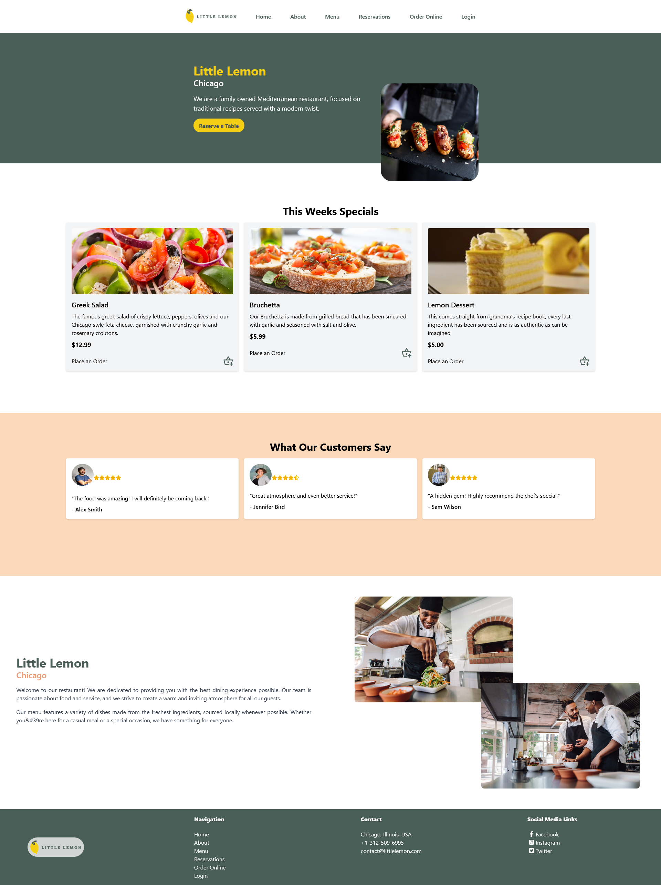
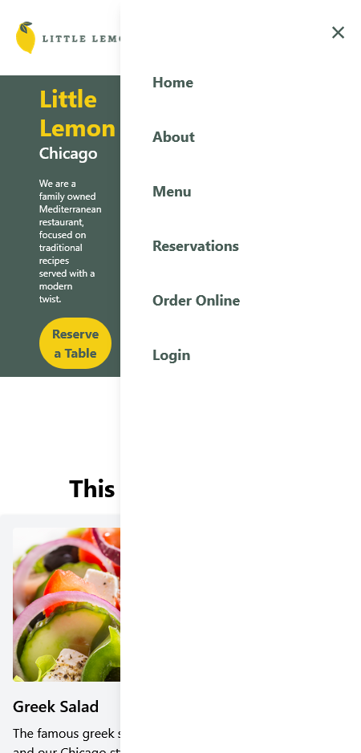

# 🍋 Little Lemon Booking System - Final Project

This project was developed to fulfill the requirements of the Meta Front-End Professional Certificate on Coursera. It showcases proficiency in React and other front-end technologies, including JavaScript, HTML, and CSS.

## ⚒️ Built with:

- React
    - useEffect
    - useState
    - useRef
- React Router
    - useLocation
    - Link
    - useNavigate
- React Icons
- Open Graph
- Vite
- Tailwind

## 🖼️ Pictures

### Full Website

### Mobile Menu
<p align="center">
  
</p>

## 📝 Some Code [From BookingConfirmation.jsx]

```javascript
import { useLocation } from "react-router-dom";

const BookingConfirmation = ( ) => {
  ...
  const bookingDetails = [
    { label: "Name", value: name },
    { label: "Email", value: email },
    { label: "Date", value: date },
    { label: "Time", value: time },
    { label: "Number of Guests", value: guests },
    { label: "Occasion", value: occasion },
  ];

  return (
    <section>
        ...
        <h1 className="font-bold text-3xl text-center mb-4">Booking Confirmed! 🎉</h1>
        <p>Thank you for your booking {name}!</p>
        <p>We have received your booking details:</p>
        <ul className="p-5">
          {bookingDetails.map(({ label, value }) => (
            <li key={label}>
              <strong>{label}:</strong> {value}
            </li>
          ))}
        </ul>
        <Link to="/" className="flex items-center justify-center mt-4 font-semibold text-llgreen hover:text-llyellow">
          <span className="mr-2">Go Back</span>
          <IoMdArrowRoundBack />
        </Link>
    </section>
  );
}
```

## 🔗 [Live Preview ](https://little-lemon-booking-three.vercel.app/)

If you find this useful, feel free to use it as a reference for you own website :)

## 👨🏻‍💻 Author

- LinkedIn - [@dahg](https://www.linkedin.com/in/dahg/)
- Coursera - [@dahg](https://www.coursera.org/learner/dahg)


♥️ _- Daniel Hernández_